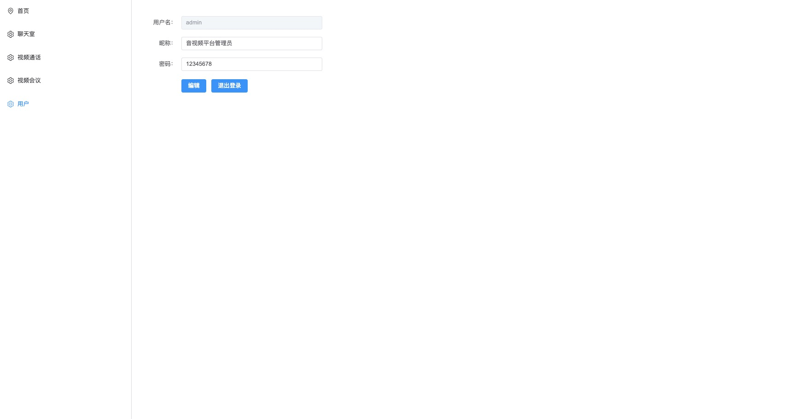

# video-webrtc

项目包含前端和后端，用户管理模块、聊天室、视频语音通话、视频会议模块，前端使用vue3+element-plus+webrtc+echarts+webSocket，后端使用nodejs+mongodb+express+session

使用链接：http://47.97.222.215/#/login

## 项目进度

- [x] 用户管理、登录注册模块

- [x] 最近七日pv、uv统计展示

- [x] 聊天室（单聊和群聊）

- [x] 音视频通话

- [x] 视频会议

## 项目展示

#### 登录注册页面

#### 用户管理页面

#### 最近七日pv、uv统计展示页面

#### 聊天室单聊

#### 聊天室群聊

#### 音视频通话页面

#### 视频会议页面

